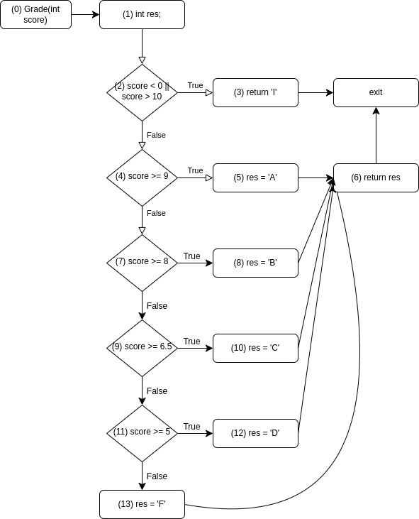
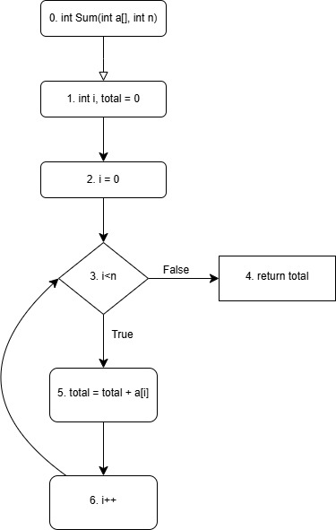
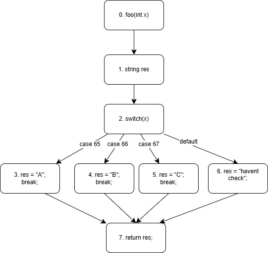
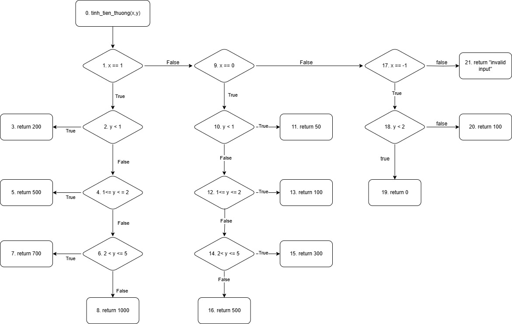

### Bài 1:
Các bước trong quá trình kiểm thử một đơn vị chương trình theo phương pháp kiểm thử dòng điều khiển với một độ đo kiểm thử cho trước:
Bước 1: Phân tích mã nguồn và xây dựng đồ thị dòng điều khiển.
- Xác định các khối lệnh cơ bản: Có thể nhóm các câu lệnh liền kề cùng chức năng thành một khối lệnh, hoặc cũng có thể tách riêng chúng.
- Xác định các cạnh: xác định khối nào có thể thực thi sau khối nào.
Bước 2: Từ độ đo kiểm thử cho trước, xác định yêu cầu về các đường đi.
- Phủ đường đi: yêu cầu phải đi qua tất cả cái path có trong chương trình.
- Phủ cấp 1 (C1): yêu cầu các đường đi phải đi qua tất cả câu lệnh ít nhất một lần.
- Phủ cấp 2 (C2): yêu cầu các đường đi phải đi qua tất cả các nhánh ít nhất một lần.
- Phủ cấp 3 (C3): yêu cầu đường đi sao cho mỗi điều kiện con của từng điểm quyết định đều được thực hiện ít nhất một lần cho trường hợp True và False
Bước 3: Xác định các đường đi của chương trình sao cho khi chúng thực hiện thì độ đo kiểm thử tương ứng được thỏa mãn.
Bước 4: Sinh các ca kiểm thử: mỗi đường đi sinh ra một ca kiểm thử tương ứng.
Bước 5: Thực hiện các ca kiểm thử
### Bài 2
CFG:

Đường đi với độ đo C1:
- Path 1: 0 - 1 - 2(T) - 3
	- Test case: grade(-2)
	- Scov: 3/13
- Path 2: 0 - 1 - 2(F) - 4(T) - 5 - 6
	- Test case: grade(9)
	- Scov: 6/13
- Path 3: 0 - 1 - 2(F) - 4(F) - 7(T) - 8 - 6
	- Test case: grade(8)
	- Scov: 8/13
- Path 4: 0 - 1 -2(F) - 4(F) - 7(F) - 9(T) - 10 -6
	- test case: grade(7)
	- Scov: 10/13
- Path 5: 0 - 1 -2(F) - 4(F) - 7(F) - 9(F) - 11(T) - 12 - 6
	- test case: grade(6)
	- Scov: 12/13
- Path 6: 0 - 1 -2(F) - 4(F) - 7(F) - 9(F) - 11(F) - 13 - 6
	- test case: grade(4)
	- Scov: 13/13
Đường đi và ca kiểm thử của độ đo C2 tương tự C1.

### Bài 3
cfg:

Đường đi với độ đo C1:
- Path: 1, 2, 3(T), 5, 6, 3(F), 4
	- test case: a[] = new int[]{1,2,3}; n = 1;
	- Scov: 6/6
Đường đi với độ đo C2:
- Path: 1, 2, 3(T), 5, 6, 3(F), 4
	- test case: a[] = new int[]{1,2,3}; n = 1;
	- Bcov: 6/6
Kiểm thử vòng lặp:
- Vòng lặp thực hiện 0 lần:
	- Path: 1, 2, 3(F), 4
	- test case: a = null; n=0;
- vòng lặp thực hiện 1 lần:
	- Path: 1, 2, 3(T), 5, 6, 3(F), 4
	- test case: a[] = new int[]{1}; n = 1;
- vòng lặp thực hiện  2 lần:
	- Path: 1, 2, 3T, 5, 6, 3T, 5, 6, 3F, 4;
	- test case: a[] = new int[]{1}; n = 2;
- vòng lặp thực hiện  3 lần:
	- Path: 1, 2, 3T, 5, 6, 3T, 5, 6, 3T, 5, 6, 3(F), 4;
	- test case: a[] = new int[]{1}; n = 3;

### Bài 4
CFG:

C2 coverage paths:
- Path 1: 1,2,3,7
	- test case: x=65
	- Bcov: 4/7
- Path 2: 1,2,4,7
	- test case: x=66
	- Bcov: 5/7
- Path 3: 1,2,5,7
	- test case: x=67
	- Bcov: 6/7
- Path 3: 1,2,6,7
	- test case: x=70
	- Bcov: 7/7
### Bài 5
CFG:

C2 coverage paths:
- Path 1: 0 - 1(T) - 2(T) - 3
	- Test Case: (x=1, y=0)
	- Bcov: 2/20
- Path 2: 0 - 1(T) - 2(F) - 4(T) - 5
	- Test Case: (x=1, y=1)
	- Bcov: 4/20
- Path 3: 0 - 1(T) - 2(F) - 4(F) - 6(T) - 7
	- Test Case: (x=1, y=3)
	- Bcov: 6/20
- Path 4: 0 - 1(T) - 2(F) - 4(F) - 6(F) - 8
	- Test Case: (x=1, y=6)
	- Bcov: 7/20
- Path 5: 0 - 9(T) - 10(T) - 11
	- Test Case: (x=0, y=0)
	- Bcov: 10/20
- Path 6: 0 - 9(T) - 10(F) - 12(T) - 13
	- Test Case: (x=0, y=1)
	- Bcov: 12/20
- Path 7: 0 - 9(T) - 10(F) - 12(F) - 14(T) - 15
	- Test Case: (x=0, y=3)
	- Bcov: 14/20
- Path 8: 0 - 9(T) - 10(F) - 12(F) - 14(F) - 16
	- Test Case: (x=0, y=6)
	- Bcov: 15/20
- Path 9: 0 - 17(T) - 18(T) - 19
	- Test Case: (x=-1, y=1)
	- Bcov: 18/20
- Path 10: 0 - 17(T) - 18(F) - 20
	- Test Case: (x=-1, y=2)
	- Bcov: 19/20
- Path 11: 0 - 17(F) - 21
	- Test Case: (x=-2, y=0)
	- Bcov: 20/20

Báo cáo kiểm thử

| ID  | Input x | Input y | Expected Output | Actual Output   | Result |
| --- | ------- | ------- | --------------- | --------------- | ------ |
| 1   | 1       | 0       | 200             | 200             | Passed |
| 2   | 1       | 2       | 500             | 500             | Passed |
| 3   | 1       | 3       | 700             | 700             | Passed |
| 4   | 1       | 6       | 1000            | 1000            | Passed |
| 5   | 0       | 0       | 50              | 50              | Passed |
| 6   | 0       | 1       | 100             | 100             | Passed |
| 7   | 0       | 3       | 300             | 300             | Passed |
| 8   | 0       | 6       | 500             | 500             | Passed |
| 9   | -1      | 1       | 0               | 0               | Passed |
| 10  | -1      | 2       | 100             | 100             | Passed |
| 11  | -2      | 0       | 'Invalid input' | 'Invalid input' | Passed |

